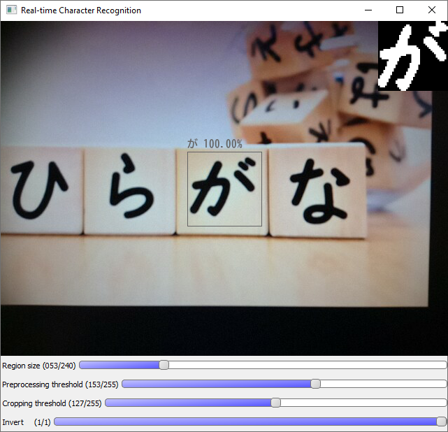

# Real-time Optical Japanese Character Recognition

Real-time Japanese hiragana character recognition with CNN using Python & OpenCV.


## About

This small machine learning project is a follow up on my [previous project](https://github.com/kuchynkm/hiragana-recognition-cnn), 
where I built and trained a convolutional model for optical recognition of Japanese hiragana characters. 
The aim of this project is to employ the mentioned model in building a real-time OCR system for a camera input.

**Input:** video stream from camera device (such as webcam or ip camera).


**Output:** video stream with the model prediction, its confidence and with preview of the actual model input. 

The prediction together with its confidence is printed above the recognition region

### How it works:

In the camera window, there is a gray frame signifying the recognition region. 
The content of this region is cropped, preprocessed and sent to the model as an input. 
The model automatically performs an inference and the corresponding prediction together with its confidence is printed above the frame in real-time. 
In the upper right corner, there is a preview of the actual model input on which the inference is made at the moment. 
Size of the frame together with a few processing parameters can be adjusted by the corresponding trackbar on the bottom of the window.

### Testing on manga: 
I'm including a few screenshots taken when I was testing the script on one of my manga books - 黒崎くんの言いなりになんてならない (Kurosaki-kun no iinari ni nante naranai). 


## How to use

### Dependencies
The following packages and libraries are needed:
* tensorflow 
* numpy
* opencv
* pillow (only for running the script)
* imutils


### Running the script
To run the script, type the following line in the commandline: 

```
python recognition.py -input source
```

 where `input` is the type of your video input (webcam/IP camera) and `source` is the source specification (camera port/ip camera url). 

Examples for each type of video input:
* web camera at port 0 (default): `python recognition.py`  
```
    	python recognition.py
```
* web camera at port camera_port: `python recognition.py -webcam camera_port`  
```
    	python recognition.py -webcam 0
```
* IP camera at ip_camera_url: `python recognition.py -ipcam ip_camera_url` 
```
    	python recognition.py -ipcam http://10.0.0.15:8080/video
```

After running the script, a window with camera input will open. 
To perform OCR on a given character, aim the camera on the character so that the 
character is contained within the recognition region specified by the gray frame. 
The script can be halted by pressing Esc.




### Adjustments

There are four trackbars enabling for manual adjustments of the following:
* **the recognition region size:** the gray frame in the center of the image, specifies the region on which the model inference takes place
* **the preprocessing threshold:** from 0 to 255, specifies threshold for conversion of the model input to black & white  
* **the cropping threshold:** from 0 to 255, specifies threshold for contour detection used for cropping the character 
* **invert option:** 0 or 1, enables for detection of light characters on a dark background (when 0) and dark characters on a light background (when 1).


## Links:
* The hiragana recognition model: [https://github.com/kuchynkm/hiragana-recognition-cnn](https://github.com/kuchynkm/hiragana-recognition-cnn)
